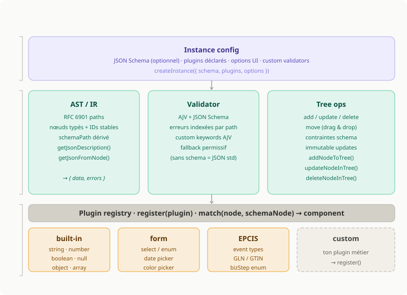

# The future of leaf it to me

This is still largely a WIP. Here are some thoughts about the future architecture of lite:

## Differents modules

### JSON AST/IR

The usage of an intermediary representation for JSON is really useful to define and update it based on strict or loose rules. This point shouldn't change.  
However, the current usage of path is not very useful. In particular, `<root>` objects are a pain, and defining a type is not very future proof (no customisation).

1. We should use [RFC 6901](https://www.rfc-editor.org/rfc/rfc6901) for the path. It's widely used and very efficient.
2. In addition, using a `schemaPath` for defining custom objects could be really useful.

#### Example (JSON -> AST)

```json
{
  "user": {
    "name": ""
  }
}
```

```json
{
  "id": "root",
  "type": "object",
  "path": "/",
  "schemaPath": "#",
  "children": [
    {
      "id": "n-user",
      "type": "object",
      "name": "user",
      "path": "/user",
      "schemaPath": "#/properties/user",
      "children": [
        {
          "id": "n-name",
          "type": "string",
          "name": "name",
          "path": "/user/name",
          "schemaPath": "#/properties/user/properties/name",
          "value": ""
        }
      ]
    }
  ]
}
```

### JSON Schema

Instead of simply allowing a standard JSON object, we should give the possibility to set a custom schema. The good news is, we have the perfect tool for that: [JSON Schema](https://json-schema.org/).  
If we use it, we could simply set a meta schema for JSON by default, and consider leaf it to me as a UI tool for JSON Schema.

#### Example

##### Standard JSON Schema

```json
{
  "$id": "user.schema.json",
  "type": "object",
  "title": "User",
  "properties": {
    "user": {
      "type": "object",
      "properties": {
        "name": {
          "type": "string",
          "minLength": 1,
          "description": "User name"
        }
      },
      "required": ["name"]
    }
  },
  "required": ["user"]
}
```

We could also consider adding some UI information in the schema for complex cases, such as EPCIS 2.0 (GS1).  
There is a lot of cases, and a lot of functional rules defined there. We should consider if a simple UI representation of the schema is the best solution.

##### Extended with UI

```json
{
  "schemaPath": "#/properties/eventList/items/oneOf/0",
  "ui": {
    "label": "Object Event",
    "collapsed": false,
    "hiddenFields": ["@context"],
    "defaults": {
      "eventType": "ObjectEvent"
    }
  }
}
```

### Validation

With the JSON AST and Schema defined, the last step is the validation. And with standards comes tooling, we have the perfect tool for it: [ajv](https://ajv.js.org/).  
Ajv use a JSON Schema as a set of rules, and returns all violations. As a bonus, it even includes a JSON Pointer to the invalid data.

#### Exemple

```json
[
  {
    "instancePath": "/user/name",
    "schemaPath": "#/properties/user/properties/name/minLength",
    "message": "must NOT have fewer than 1 characters"
  }
]
```

#### Wrapping it up

Lastly, we could get some inspiration from graphql to define the internal object used in leaf it to me. With two parts `data` and `errors`, we could centralize everything.

##### Complete object (inspired by graphql)

```json
{
  "data": {
    "id": "root",
    "type": "object",
    "path": "/",
    "schemaPath": "#",
    "children": [
      {
        "id": "n-user",
        "type": "object",
        "name": "user",
        "path": "/user",
        "schemaPath": "#/properties/user",
        "children": [
          {
            "id": "n-name",
            "type": "string",
            "name": "name",
            "path": "/user/name",
            "schemaPath": "#/properties/user/properties/name",
            "value": ""
          }
        ]
      }
    ]
  },
  "errors": [
    {
      "path": "/user/name",
      "schemaPath": "#/properties/user/properties/name/minLength",
      "message": "Name is required"
    }
  ]
}
```

### UI

First, the current UI should be updated to match the one conceptualized in this MR. It needs some more work, but should be more modern, and less marked by Suite design.  
Some other potential evolution could be:

1. Propose styled UI as a separate package, optional integration (simple html by default)
2. Stay vanilla, no react implementation by default, but a react wrapper (or vue, or anything)
3. Allow extending or customising default inputs, and links to JSON Schema
4. Better handling of large objects with virtualization

#### New functionalities

- Inserting element at position
- Reordering elements with drag n drop and/or arrows
- Open edition on custom action (double click)

## Architecture



## Basic plugin interface

```typescript
interface Plugin {
  match: (node: Node, schemaNode?: JSONSchema) => boolean

  component: React.FC
}
```
